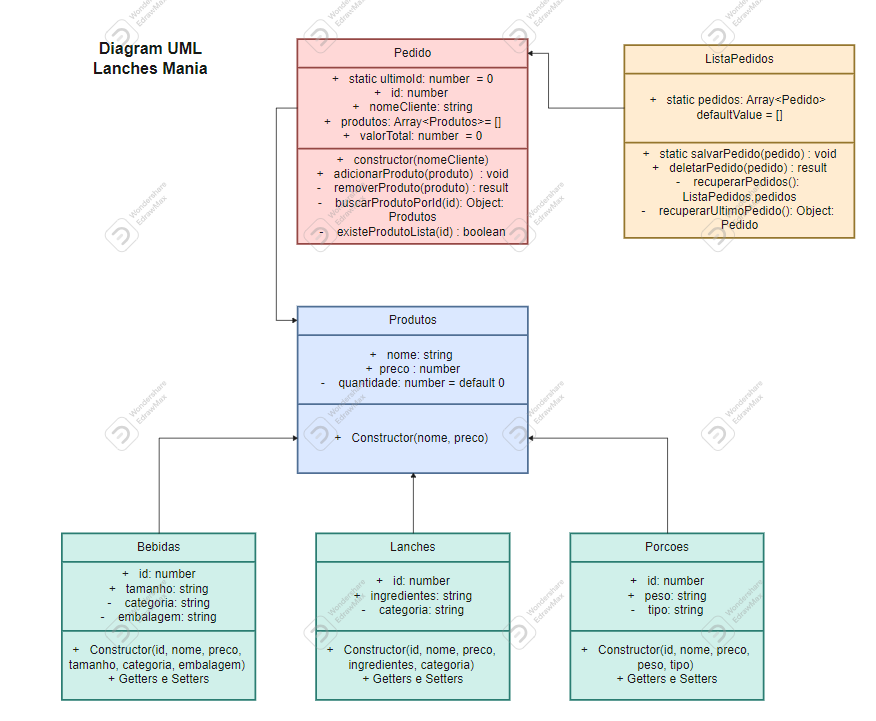

# 🍔 Lanches Mania 🍟

Bem-vindo ao cardápio digital da Lanches Mania, um projeto criado para o módulo de Programação Orientada a Objetos (POO) com JavaScript da Formação Angular da ADA. A aplicação foi estruturada através da utilização de classes.

## 🍴 Funcionalidades

Com este cardápio digital, o usuário pode facilmente cadastrar um novo pedido e adicionar produtos dos tipos: lanches, porções e bebidas. Conforme você adiciona ou remove produtos do pedido, ele é atualizado dinamicamente, mostrando o valor total do pedido. Ao confirmar o pedido, uma mensagem é exibida com a confirmação do pedido.

## 💻 Tecnologias Utilizadas

Este projeto foi desenvolvido utilizando as seguintes tecnologias:

- JavaScript
- HTML
- CSS
- Bootstrap

## 📚 Conhecimentos Aplicados

Durante o desenvolvimento deste projeto, foram aplicados os seguintes conceitos de POO (Programação Orientada a Objetos):

- Classes
- Objetos
- Construtores
- Herança e Polimofismo
- Métodos estáticos 

## 📊 Diagrama UML

Como parte do projeto, desenvolvi um Diagrama UML das classes com seus relacionamentos.  

**Relacionamentos:**

- As classes: `Lanches`, `Porcoes` e `Bebidas` extendem da classe mãe `Produtos`.
- A classe `ListaPedidos` possui um relacionamento com a classe Pedido, pois seu atributo `pedidos` é uma lista de objetos/instâncias da classe `Pedido`.
- A classe `Pedido` se relaciona com a classe `Produtos`, pois seu atributo `produtos` é uma lista de objetos/instâncias da classe `Produtos`.  
  

### 🚀 Link do Projeto

 

[Lanches Mania](https://djehsantana.github.io/modulo3_frontend/ProjetoIndividual/)  

